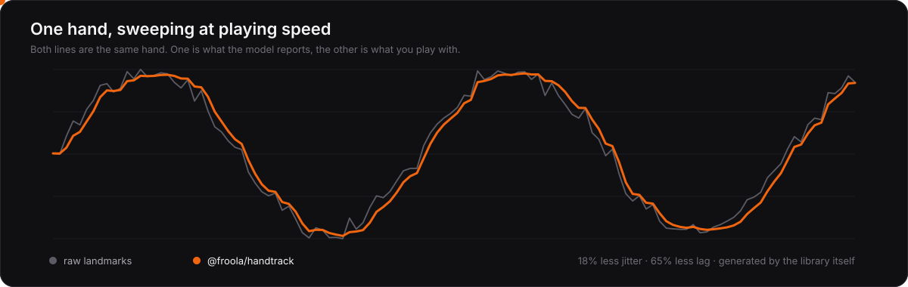

<div align="center">



<br>

[](https://github.com/froola-app/froola/actions/workflows/ci.yml) [](LICENSE) [](#scripts) [](packages/handtrack) [](tsconfig.app.json)

**[▶ Try it live](https://froolamusic.com)** · **[Read the case study](https://froolamusic.com/engineering)** · **[The tracker](packages/handtrack)** · **[Architecture](docs/ARCHITECTURE.md)**

</div>

---

Froola is a browser instrument. Your camera watches your hands, two dials on screen follow
them, and moving between the dials plays chords in whatever key and scale you pick.

```bash
git clone https://github.com/froola-app/froola.git
cd froola && npm install && npm run dev
```

No API keys. No database. No config file. No account. Open the page, allow the camera, play.

---

## 🖐 The hand tracker

MediaPipe will tell you where twenty one points on a hand are, roughly, thirty times a
second. That is not the same thing as an instrument you can play. The landmarks shiver
when the hand is still, they arrive late, they drop the odd frame, and any threshold you
put near them chatters.

**[`packages/handtrack`](packages/handtrack)** is the layer in between: a
dependency-free library that never imports MediaPipe, touches the DOM, or knows what a
camera is. It takes landmarks and a timestamp.



> The smooth line above is not an illustration. It is this library's real output on the
> jagged line beside it: the image is generated by `npm run assets`, which runs the actual
> filter over a seeded trace.

### Measured, not asserted

| | Before | After | |
|---|---:|---:|---|
| Jitter, hand held still | 2.86 | **2.35** | 18% steadier |
| Lag behind a moving hand | 59.6 ms | **21.1 ms** | 65% quicker |
| Settling after a jump | 300 ms | **33 ms** | 9× faster |
| Fist flicker at the threshold | 108 | **1** | over 200 frames |
| Slot flicker between targets | 106 | **0** | over 200 frames |

The baseline is what this replaced, and what most integrations reach for: a fixed
exponential moving average. Improving jitter **and** lag together is the whole claim, and
no fixed cutoff can do it. `npm run bench` regenerates every number from seeded synthetic
traces into [BENCHMARK.md](packages/handtrack/BENCHMARK.md), and the benchmark asserts that
pair by name so it fails loudly if the filter ever drifts back into being a plain low pass.

<details>
<summary><b>The five stages, and why each one exists</b></summary>

<br>

| # | Stage | Because |
|---|---|---|
| 1 | **Score, don't judge** | Finger curl comes out 0–1, not yes/no. A boolean picks a threshold, and a hand resting on it flips every frame. |
| 2 | **Assign by position, with hysteresis** | Position decides which wheel a hand drives, never the model's own left/right label, which flickers. But a hand resting midway between wheels is equidistant, so last frame's answer is kept unless a rival wins by a margin and holds it. |
| 3 | **[One Euro filter](https://gery.casiez.net/1euro/)** | Cutoff follows hand speed, so a still hand gets heavy smoothing and a moving hand gets almost none. One filter, both behaviours, two legible parameters. |
| 4 | **Schmitt trigger + dwell** | It takes more curl to close a fist than to release one, so no curl value is unstable. A short dwell rejects the single blurry frame. |
| 5 | **Coast, then predict** | A dropped detection is not evidence the hand moved. And since inference is slower than the display, project forward along the velocity the filter already computed. |

The alpha is derived from each sample's real `dt` in exponential form, so the filter behaves
identically at 60 Hz on a desktop GPU delegate and 15 Hz on a phone's CPU delegate.

</details>

<details>
<summary><b>What it deliberately does not claim</b></summary>

<br>

- **Two hands closer together than the landmark noise cannot be told apart.** No amount of
  filtering recovers an identity the input does not contain, and the benchmark does not
  pretend otherwise.
- **Synthetic traces are not hands.** They isolate one property at a time, which is what
  makes them measurable and also what makes them incomplete.
- **The tuning is specific to normalized 0–1 coordinates at ~30 Hz.** `beta` looks enormous
  next to published pixel-space values for exactly that reason.
- **Facing needs world landmarks.** Passing normalized ones produces confident nonsense.

</details>

## 🎹 How it works

- **Left hand → note dial.** Position around the wheel picks a scale degree; its chord root
  and quality follow the key and scale you chose.
- **Right hand → extension dial.** Adds colour on top: triad, 6th, 7th, 9th, add9, sus2, sus4.
- **Height** sets the register.
- **Make a fist** to lock the current chord and move freely without changing it.

On top of that sit a chord looper, an arpeggiator whose rate follows hand height, custom
chord wheels, video and MP3 export, and a lesson path with spaced-repetition review.

## 🧩 The engine

Everything musical lives in `src/engine/`, independent of the React app that renders it.

| Module | What it owns |
|---|---|
| [`packages/handtrack`](packages/handtrack) | Filtering, slot identity, gesture gating, coasting, prediction |
| `engine/input/` | Camera and MediaPipe lifecycle: stream, delegate choice and fallback, inference pacing |
| `engine/music/` | Keys, scales, chord voicings, and the gesture-to-chord mapping |
| `engine/audio/` | Web Audio synth and sampler, tempo clock, backing arrangements |
| `engine/looper/` | Chord looper with beat-quantised slots |
| `engine/arp/` | Arpeggiator driven by the same clock |
| `engine/renderer/` | Canvas 2D dials, hand markers, particles, shared wheel geometry |
| `engine/recording/` | Bit-packed gesture codec, video and MP3 capture, local/cloud stores |
| `engine/lessons/` | Curriculum, scoring, drill bank, Leitner spaced-repetition scheduler |

`src/coordinator.ts` wires them together in one `requestAnimationFrame` loop. That loop
talks to refs, never React state, so a re-render can never land between a hand moving and a
note sounding. [`docs/ARCHITECTURE.md`](docs/ARCHITECTURE.md) goes through it properly.

## 🔒 Privacy

Camera frames are processed locally by MediaPipe's WASM runtime and never transmitted. No
video or image data leaves your device. With no Supabase project configured, nothing leaves
your device at all: recordings live in IndexedDB, progress in localStorage.

## Scripts

```bash
npm run dev         # dev server
npm run build       # typecheck + production build
npm run test        # vitest run
npm run bench       # regenerate BENCHMARK.md from the real filter
npm run assets      # regenerate the README's animated SVGs
npm run lint        # eslint
npm run typecheck   # tsc -b, no emit
```

## Browser support

| Browser | Camera mode |
|---|---|
| Chrome (desktop) | ✅ |
| Safari (desktop) | ✅ |
| Firefox | ✅ |
| Chrome (Android) | ✅ |
| Safari (iOS 15.4+) | ✅ |

Touch works too: two fingers drive the two wheels.

<details>
<summary><b>Optional: sync across devices with Supabase</b></summary>

<br>

Froola stores recordings and lesson progress in the browser by default, and that path is
the one that gets the attention. If you want progress to follow a player between devices,
point it at your own [Supabase](https://supabase.com) project:

1. Create a project. Under **Authentication → Providers**, enable Google (add your OAuth
   client from the Google Cloud Console, with the Supabase callback URL as an authorised
   redirect URI).
2. Under **Authentication → URL Configuration**, allowlist
   `http://localhost:5173/auth/popup` and your production origin plus `/auth/popup`. The
   sign-in popup passes this as `redirectTo`, so the OAuth flow fails without it.
3. Apply the schema in `supabase/migrations/`.
4. Copy the project URL and anon key from **Project Settings → API** into `.env`:

```env
VITE_SUPABASE_URL=
VITE_SUPABASE_ANON_KEY=
```

With those set, signing in becomes available and syncs on top of local storage. Without
them the sign-in UI never appears and nothing else changes. Sign-in is a sync feature,
never a gate.

</details>

<details>
<summary><b>A note on the lessons, and on <code>optional/</code></b></summary>

<br>

Song lessons teach chord progressions, which aren't copyrightable, and are named for what
they teach rather than for records they evoke. No melodies, lyrics, or audio from any
recording are in this repository, and none should ever be added.

Froola used to be a subscription product. The Stripe integration is parked under
`optional/billing/` as a reference implementation: it is not built, not type-checked, and
nothing in `src/` imports it. Every feature is on for everyone, permanently. See
`optional/billing/README.md`.

</details>

## Contributing

Issues and pull requests are welcome. [`CONTRIBUTING.md`](CONTRIBUTING.md) covers the
layout, the house rules (the hot path stays on refs; visual work must not change dial
interaction), and what a good first change looks like.

## License

MIT. See [LICENSE](LICENSE).

<div align="center">
<br>
<sub>Built by <b>Dennis Xue</b> and <b>Felicia Aung</b></sub>
</div>
