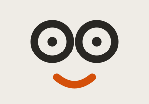
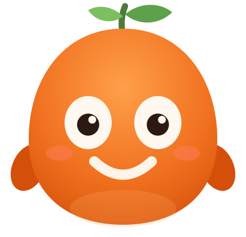
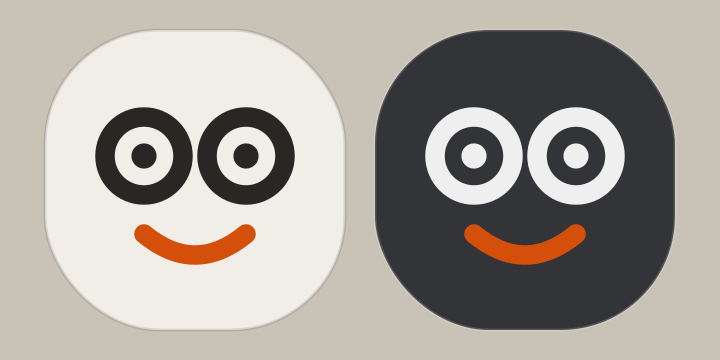
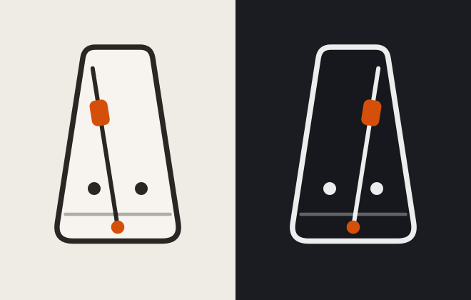
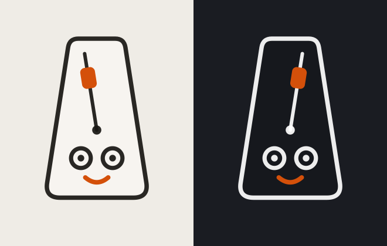

# Froo — the froola mascot: design history

*July 2026. Covers `src/components/FroolaMascot.tsx` (the character),
`src/components/FroolaGuide.tsx` (the tour + tips system), and the
`.froo` / `.froo-guide` sections of `src/App.css`.*

Froola needed a guide: new users finished the four-step tutorial and were
dropped onto a screen with a dozen controls and no idea loops, recording, or
Learn existed. The brief grew out of user feedback across one long session:

> "a small cute froola who will guide the user … but you have to include it
> in a way that it doesn't seem like a game."

That tension — *cute enough to be a character, serious enough for a
professional tool* — took five iterations to resolve. Each one is preserved
as an SVG snapshot in `design/froo/`.

---

## v1 — the bare logo face (rejected: too simple)

The living-logo hero on the landing page already animates the wordmark's two
o's as eyes. First pass extracted exactly that: two ring eyes + brand smile,
floating free, with blink and pupil tracking.

**Feedback:** "You only took a smiley face from the logo. While this is okay,
it looks extremely simple and DOES NOT look like a cute mascot."

**Lesson:** a face is not a character. It needs a body, a silhouette, a
thing it *is*.

## v2 — the orange gumdrop (rejected: childish)

Full Clawd-style character: gumdrop body in a warm orange gradient, leaf
sprout (froola sounds like fruit), big cream eyes, blush, stubby arms with a
periodic wave, breathing idle animation, squash-and-bounce on success.

**Feedback:** "Remember how I said I don't want it to look like a game.
Froola is supposed to be a fun TOOL. Tool that professionals could use. They
wouldn't want this childish cartoon orange being the mascot."

**Lesson:** delight has to read as product craft, not game art. Gradients-as-
candy, costumes, and bouncy limb animation all code "game."

## v3 — the glass logo chip (rejected: still just the logo)

Swing to the opposite pole: the logo face set in a squircle pebble cut from
the play HUD's liquid-glass material (theme fill, theme ink, hairline
stroke). Restrained motion only — blink, gaze, one nod.

**Feedback:** "So you just took the logo smile again. We don't want that.
Think of Notion. Smart, clean, and nice. DO NOT RETAKE THE LOGO. Take the
logo *theme*, but don't just make a smiley face again."

**Lesson:** the mark itself is off-limits as the whole design. What carries
over is the *theme*: hairline ink + one confident orange move.

## v4 — the metronome (right idea, not identifiable)

Notion-style thinking: pick a smart object from the product's own domain and
draw it cleanly. A metronome keeps time — which is what the guide does for
the player — and it earns honest motion: the pendulum idles at a slow tick
and **locks to the loop's BPM while it plays** (one full swing = two beats).
Hairline ink shell in the theme color, glass fill whisper, one orange accent
(the pendulum weight). Face reduced to two dot eyes.

**Feedback:** "I like it better than the previous ones, but I don't want you
to get rid of the smile and distinct froola eyes. We cannot identify it's
Froo from the metronome."

**Lesson:** the object solves "what is it"; the brand face solves "whose is
it." You need both.

## v5 — the metronome with the froola face (current)

The v4 metronome wearing the brand's face: the wordmark's ring o-eyes
(pupils blink, and glance toward the pointer) and the orange smile, drawn at
the same hairline stroke weight as the shell. The pendulum pivots *above*
the face so the swing never crosses the eyes or smile.

### Final spec

- **Geometry** — 100×116 viewBox; shell is a rounded trapezoid, 2.5px ink
  stroke; eyes r 5.6 at (41, 78)/(59, 78) with r 1.9 pupils; smile
  `M 43.5 89 Q 50 94.5 56.5 89` in `#D4500A`; pendulum pivots at (50, 62).
- **Color** — ink = `--lg-top-ink` (theme-driven: near-black in light, white
  in dark); shell fill = `--lg-top-fill` (the HUD glass fill); the only
  saturated color is brand orange `#D4500A` (weight + smile).
- **Motion** — pendulum: `--froo-tick` CSS var, default 3.6s idle, set to
  `120/bpm` seconds while the loop plays. Eyes: blink every ~3–6s
  (occasional double), pupils ease toward the pointer and wander when it's
  idle (all disabled under `prefers-reduced-motion`). Success: eyes close
  into content arcs + one small nod on the same spring curve as the HUD
  buttons. Nothing else moves.

### The guide behavior (FroolaGuide)

- **Tour** — five steps after the tutorial, advancing by *observing* the
  looper (added a chord → next step; pressed play → next step), with dwell
  timers for the "just play" beats. Progress in `froola.guideStep`,
  completion in `froola.guideDone`; Replay tutorial resets both.
- **Introduction** — once ever, ~6s after the tour ends: "Hi, I'm Froo. I
  keep time down here. Tap me whenever you want a tip." The only bubble
  with an ×. Flag: `froola.frooIntroSeen`.
- **Tips** — 20 tips covering the whole surface (wheels, fist lock, nod
  volume, extensions, key/scale/octave, arp, bpm, undo/clear, record/video/
  share, Learn, dark mode, Enter, replay). Tapping Froo cycles to the next
  one; they auto-hide after 14s and carry no ×. Unprompted tips surface
  every ~3 minutes until the cycle wraps once (`froola.tipCursor`,
  `froola.tipsCycled`), after which Froo only speaks when poked.
- **Bubble** — the HUD glass material with a tail pointing at Froo, popped
  in on a spring; compact and low so it clears the left dial.

### Design rules distilled

1. Personality comes from a **smart object in the product's domain**, not a
   blob with a grin.
2. The **brand face (ring o-eyes + orange smile) makes it froola's** — keep
   it, but never ship the face alone.
3. Materials come from the design system: theme ink, liquid-glass fill,
   hairline strokes, DM Sans, one orange accent.
4. Motion must be **honest** (the pendulum keeps real time) and quiet
   (blink, gaze, one nod). No waving, bouncing, or breathing.
5. No gamification anywhere around it: no points, confetti, or streaks.
